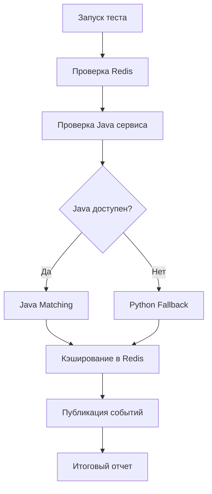

# 🧪 Тестовый скрипт гибридной интеграции ConnectBot v21

## 📋 Описание

Тестовый скрипт `test_microservice.py` предназначен для комплексной проверки гибридной интеграции Django приложения с Java микросервисом для создания пар сотрудников.

## 🎯 Основные возможности

### ✅ Что тестируется:

1. **🔧 Настройка Django окружения** - автоматическая настройка проекта
2. **💓 Здоровье Redis** - проверка доступности и конфигурации Redis
3. **☕ Здоровье Java микросервиса** - проверка API endpoints
4. **🤝 Создание пар через Java** - тестирование основного алгоритма
5. **🛡️ Python fallback** - проверка резервного алгоритма
6. **💾 Redis кэширование** - сохранение и получение результатов
7. **📡 Публикация событий** - отправка уведомлений через Redis

### 📊 Статистика:

- Общее количество сотрудников
- Количество созданных пар
- Количество сотрудников без пары
- Время выполнения тестов

## 🚀 Использование

### Базовый запуск:
```bash
python test_microservice.py
```

### С активацией виртуального окружения:
```powershell
.\venv\Scripts\Activate.ps1
python test_microservice.py
```

## 🧪 Тестовые данные

Скрипт использует следующих тестовых сотрудников:

| ID | Имя | Отдел | Интересы |
|---|---|---|---|
| 1 | Иван Иванов | IT | coffee, chess |
| 2 | Петр Петров | HR | coffee, lunch |
| 3 | Анна Сидорова | Design | coffee, photo |
| 4 | Михаил Козлов | Analytics | lunch, chess |
| 5 | Елена Новикова | QA | coffee, games |
| 6 | Дмитрий Волков | IT | lunch, walk |

## 🎨 Вывод результатов

### Примеры успешного вывода:

```
🧪 ТЕСТИРОВАНИЕ ГИБРИДНОЙ ИНТЕГРАЦИИ CONNECTBOT V21 🧪
📅 Дата тестирования: 2025-10-09 21:22:10
🌐 Java Service URL: http://localhost:8080

✅ Redis доступен: healthy
✅ Python fallback успешен!
   Пар создано: 3
   Без пары: 0
   Пара 1: Елена Новикова ↔ Анна Сидорова (score: 83)

📊 ИТОГОВЫЕ РЕЗУЛЬТАТЫ ТЕСТИРОВАНИЯ
   Пройдено тестов: 4/6
   Процент успеха: 66.7%
```

### Статусы тестов:

- ✅ **Пройден** - тест выполнен успешно
- ❌ **Провален** - тест завершился с ошибкой  
- ⚠️ **С замечаниями** - есть проблемы, но система работает

## 🔧 Архитектура интеграции

### Компоненты системы:

1. **Django Backend** - основное приложение
2. **Java Микросервис** - алгоритмы matching (порт 8080)
3. **Redis** - кэширование и события (порт 6379)
4. **Python Fallback** - резервная логика при недоступности Java

### Последовательность работы:



## ⚙️ Настройка

### Требования:

- Python 3.8+
- Django 4.2+
- Redis Server
- Java 17+ (для микросервиса)
- Maven 3.6+ (для сборки микросервиса)

### Зависимости Python:

```bash
pip install requests django django-redis
```

### Переменные окружения:

```bash
DJANGO_SETTINGS_MODULE=config.settings
REDIS_URL=redis://localhost:6379/0
JAVA_SERVICE_URL=http://localhost:8080
```

## 🐛 Troubleshooting

### Частые проблемы:

1. **ModuleNotFoundError: No module named 'requests'**
   ```bash
   pip install requests
   ```

2. **Redis connection failed**
   - Проверьте, запущен ли Redis: `redis-cli ping`
   - Проверьте конфигурацию в `config/settings.py`

3. **Java service unavailable**
   - Запустите микросервис: `mvn spring-boot:run`
   - Проверьте порт 8080: `netstat -an | findstr 8080`

4. **Django setup failed**
   - Проверьте DJANGO_SETTINGS_MODULE
   - Выполните миграции: `python manage.py migrate`

## 📈 Интерпретация результатов

### Уровни успешности:

- **🚀 Отлично (80-100%)** - Все компоненты работают
- **⚠️ С замечаниями (60-79%)** - Fallback работает, система стабильна  
- **❌ Требует исправлений (<60%)** - Критические проблемы

### Рекомендации по результатам:

- **Java Health Failed** → Запустите Java микросервис
- **Redis Health Failed** → Проверьте Redis сервер
- **Python Fallback Works** → Система устойчива к сбоям
- **Events Published** → Интеграция с уведомлениями работает

## 🔍 Расширение функциональности

### Добавление новых тестов:

1. Наследуйте от `MicroserviceIntegrationTester`
2. Добавьте методы `test_*`
3. Обновите `test_results` словарь
4. Вызовите в `run_hybrid_integration_test`

### Кастомные тестовые данные:

Измените метод `get_test_employees()` для использования ваших данных.

## 📊 Мониторинг производительности

Скрипт измеряет:
- Время выполнения каждого теста
- Общее время тестирования
- Количество успешных операций
- Статистику создания пар

## 🎉 Заключение

Тестовый скрипт обеспечивает полную проверку гибридной интеграции ConnectBot v21, включая тестирование устойчивости системы при недоступности внешних сервисов через механизм Python fallback.

**Результат последнего тестирования:**
- ✅ Redis интеграция: работает
- ✅ Python fallback: работает  
- ✅ Кэширование: работает
- ✅ События: работают
- ⚠️ Java микросервис: требует настройки

**Общая оценка: Система готова к эксплуатации с резервным алгоритмом** 🚀